<p align="center">
  
</p>

<h1 align="center">GResume</h1>

<p align="center">
  <strong>面向多岗位求职的本地优先简历工作台</strong><br />
  <sub>维护基础简历，派生 JD 版本，发布固定快照，并跟踪每次投递。</sub>
</p>

<p align="center">
  <a href="https://506resume.cc/"><strong>在线体验</strong></a> ·
  <a href="#product">Product</a> ·
  <a href="#快速开始">快速开始</a> ·
  <a href="#engineering">Engineering</a> ·
  <a href="#配置与自托管">自托管</a> ·
  <a href="https://github.com/506-FETL/resume/issues">问题反馈</a>
</p>

<p align="center">
  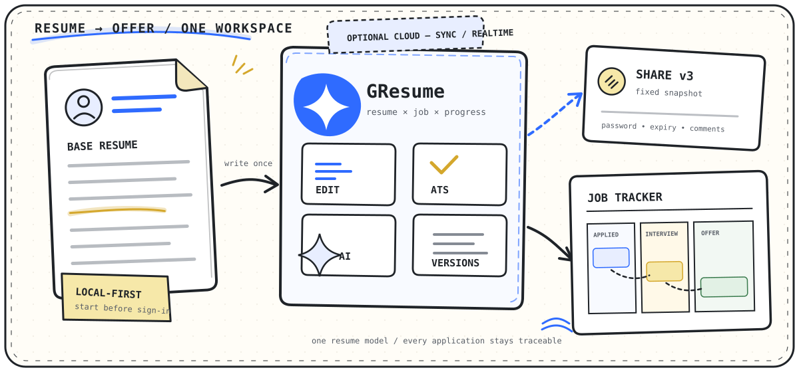
</p>

---

## 目录

- [Part I — Product](#product)
  - [项目概览](#项目概览)
  - [核心能力](#核心能力)
  - [一条完整的求职工作流](#一条完整的求职工作流)
  - [快速开始](#快速开始)
  - [使用指南](#使用指南)
  - [功能与使用边界](#功能与使用边界)
  - [产品预览](#产品预览)
  - [常见问题](#常见问题)
- [Part II — Engineering](#engineering)
  - [架构概览](#架构概览)
  - [产品能力如何落到代码](#产品能力如何落到代码)
  - [技术栈](#技术栈)
  - [双 CRDT 协作引擎](#双-crdt-协作引擎automerge--yjs--supabase-realtime)
  - [流式 Agent 与受控写入](#流式-agent-与受控写入deepseek--tool-calling--zod--edge-function)
  - [确定性 A4 分页](#确定性-a4-分页treewalker--range-clientrects--resizeobserver)
  - [跨版本全文审阅](#跨版本全文审阅grapheme-锚点--上下文指纹--事件补偿)
  - [项目结构](#项目结构)
  - [配置与自托管](#配置与自托管)
  - [开发与验证](#开发与验证)
  - [安全说明](#安全说明)
  - [参与贡献](#参与贡献)
  - [许可证](#许可证)
  - [维护者与致谢](#维护者与致谢)

---

<a id="product"></a>

## Part I — Product

### 项目概览

GResume 是一套面向个人求职过程的工作台，把简历从创建到投递后的全过程连起来：同一份基础资料可以派生多个岗位版本，每个版本都能被分析、导出、分享，并与实际投递进度保持对应。

求职过程中容易丢失的往往不是文件，而是文件之间的关系：哪一版投给了哪家公司、为什么这样改、对方看到的是否还是当时那一版、下一次应该何时跟进。GResume 用版本血缘、固定 Release 和求职记录保存这些上下文，减少文档副本、聊天记录与表格之间的来回切换。

#### 适合谁

- 需要针对多个 JD 持续维护定制简历的求职者。
- 希望先在浏览器中开始、再按需启用云能力的个人用户。
- 需要固定版本分享、评论反馈或实时协作的求职小组与导师。
- 希望自行部署，并继续扩展简历、ATS、AI 或求职 CRM 能力的开发者。

### 核心能力

#### 先写简历，再决定是否登录

未登录时可以直接在浏览器中创建和编辑简历，文档保存在 IndexedDB。登录后再启用云同步、历史版本、分享、评论、协作、Tracker 与 AI；核心编辑流程不以注册为前提。

#### 从基础简历派生岗位版本

每个 JD 版本都保留与父简历的血缘关系。用户可以针对岗位调整关键词、经历顺序和结果表达，同时让基础简历及其他岗位版本保持不变。ATS 评估提供结构、岗位匹配、证据强度、机器可读性与版式可读性的具体判断，不把分数当作招聘平台结果。

#### 同一份内容贯穿编辑、预览与交付

结构化表单、模板运行时、页面预览和 PDF 共用一份简历数据。分页器按浏览器实际文本行测量 A4 断点；Word 使用同一结构化内容生成，导出后仍需在目标软件中检查字体替换与版式差异。

#### 分享固定 Release，而不是变化中的工作副本

分享链接指向创建或发布时选定的当前内容或历史版本。后续编辑不会静默改变已发出的内容；需要更新时，可以保留链接并明确发布新的 Release。链接还可以配置密码、有效期和评论权限。

#### AI 先解释，再经过确认写入

助手可以读取当前简历、ATS 结果、历史版本与求职记录，并通过多步工具调用继续分析。read 工具直接返回结果；write 工具先展示摘要或 Diff，用户确认后才进入对应的持久化路径。

#### 用 Tracker 保存投递上下文

职位记录可以关联简历，保存岗位阶段、面试子阶段、联系人、活动时间线和下一步动作。Dashboard 将这些状态与简历完成度、ATS 趋势和近期任务放在同一入口。

### 一条完整的求职工作流

<p align="center">
  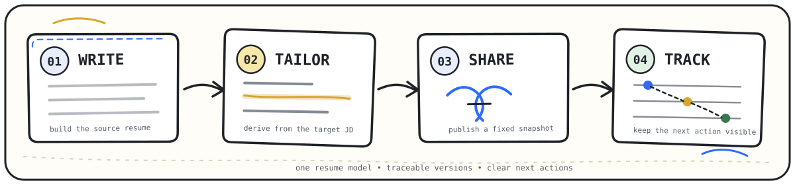
</p>

1. **Write** — 建立一份可复用的基础简历，在结构化编辑器中维护经历、技能与项目，并即时检查版式。
2. **Tailor** — 选择目标 JD，从基础简历派生独立版本；结合 ATS 结果和岗位重点修改内容，而不覆盖原始版本。
3. **Share** — 从当前内容或历史记录中选择一个确定版本，发布固定快照，并按需要配置密码、有效期和评论权限。
4. **Track** — 把投递公司、岗位阶段、面试轮次、联系人与下一步日期放进求职看板，始终知道接下来要推进什么。

这四步共享同一份简历数据模型。编辑、预览、ATS、AI、导出与分享不是互相孤立的工具，而是围绕“哪份简历正在服务哪次机会”协同工作。

### 快速开始

只想了解产品时，可以直接打开[在线版本](https://506resume.cc/)。本地运行需要 Node.js 24、pnpm 10.33.3 和一个可用的 Supabase 项目：

```bash
git clone https://github.com/506-FETL/resume.git
cd resume
corepack enable
pnpm install --frozen-lockfile
```

在项目根目录创建 `.env.local`：

```dotenv
VITE_SUPABASE_URL=https://your-project.supabase.co
VITE_SUPABASE_PUBLISHABLE_KEY=your-publishable-key
VITE_BASE_URL=http://localhost:5173
```

启动开发服务器：

```bash
pnpm dev
```

打开 `http://localhost:5173`。登录、AI、分享、评论与协作还需要数据库迁移、Edge Functions 和服务端密钥，参见[配置与自托管](#配置与自托管)。

### 使用指南

#### 1. 先选择使用模式

| 使用模式   | 能做什么                                                   | 数据与依赖                                                    |
| ---------- | ---------------------------------------------------------- | ------------------------------------------------------------- |
| 未登录使用 | 创建和编辑本地简历、切换模板、预览内容                     | 简历保存在当前浏览器的 IndexedDB；不会自动出现在其他设备      |
| 登录使用   | 云同步、历史版本、JD 血缘、分享、评论、协作、Tracker 与 AI | 需要可用的 Supabase 项目和对应服务端能力                      |
| 自行部署   | 完整掌控前端、数据库、Edge Functions 和模型密钥            | 需要完成[配置与自托管](#配置与自托管)中的环境配置和数据库部署 |

如果只是体验编辑器，直接打开[在线版本](https://506resume.cc/)即可。准备长期使用、跨设备管理或发布分享链接时，再登录并启用云端能力。

#### 2. 建立基础简历

1. 进入「我的简历」，创建一份基础简历。
2. 在编辑器中按模块填写个人信息、教育、工作、项目和技能。
3. 使用右侧预览检查分页、密度与信息层级。
4. 在模板工作台选择官方模板；需要更强的版式控制时，可基于模板继续自定义。
5. 将这份简历作为稳定的信息源。后续面向岗位的修改优先通过派生版本完成，不直接破坏基础版本。

> 建议先追求内容完整，再处理视觉细节。项目、经历和技能都稳定后，模板切换与导出会更可控。

#### 3. 为目标 JD 派生版本

1. 选择一份基础简历并创建 JD 版本。
2. 粘贴岗位描述，保留公司、岗位与关键词上下文。
3. 运行 ATS 分析，查看结构、关键词、内容质量和可读性等维度的结果。
4. 根据证据逐项修改，不要为了分数堆叠无关关键词。
5. 保存后，该版本会保留与基础简历的派生关系，便于之后回看“为什么有这一版”。

JD 版本的核心价值是隔离：同一个项目经历可以针对不同岗位强调不同结果，但基础简历仍然保持稳定，其他岗位版本也不会被连带覆盖。

#### 4. 使用 AI 助手优化内容

AI 助手可以读取你明确选择的简历、ATS 结果、历史版本与求职看板上下文，给出解释、改写建议或调用项目内工具。涉及写入的操作需要用户确认，避免模型在后台静默修改简历。

推荐的使用方式：

- 先让助手指出问题和依据，再决定是否改写。
- 每次聚焦一个目标，例如“压缩到一页”“强化量化结果”或“对齐这个 JD”。
- 写入后回到简历画布检查语义、事实和版式，不把模型输出直接视为最终结果。
- 不要把访问密钥、身份证件或与求职无关的敏感信息放入提示词。

#### 5. 导出与检查交付文件

GResume 使用同一份结构化数据生成页面预览、PDF 和 Word。导出前建议依次检查：

- 姓名、联系方式、作品链接是否为本次投递所需内容。
- 页面是否出现孤行、断页或过密区域。
- JD 版本和目标公司是否对应，避免误投其他岗位版本。
- PDF 复制文本是否正常；Word 打开后是否存在字体替换或布局偏差。
- 文件名是否包含清晰的姓名、岗位或版本标识。

#### 6. 发布固定分享快照

1. 进入分享页，选择当前内容或一个历史版本。
2. 设置便于自己识别的分享名称。
3. 按需要配置访问密码、有效期与评论权限。
4. 创建分享后再把链接交给招聘方、导师或协作者。
5. 当链接不再需要时，可以关闭、归档或删除，不必修改原始简历。

分享内容是创建时的固定快照。之后继续编辑本地简历，不会悄悄改变已经发出的版本；如果需要更新对方看到的内容，应明确发布新快照。

#### 7. 记录投递和下一步

在 Tracker 中为每个机会记录公司、职位、所用简历、当前阶段、面试轮次、联系人、活动时间线与下一步日期。Dashboard 会聚合待跟进岗位、ATS 趋势、近期动态和需要处理的简历任务。

推荐把下一步写成可执行动作，例如“周三前补充作品集链接”或“面试后 24 小时内发送感谢邮件”，而不是模糊的“继续跟进”。

### 功能与使用边界

| 能力            | 用户得到什么                           | 使用边界                                                 |
| --------------- | -------------------------------------- | -------------------------------------------------------- |
| 本地优先编辑    | 不注册也能开始创建和编辑简历           | 浏览器数据不会自动跨设备同步；清理站点数据前应先确认备份 |
| 模板与实时预览  | 同一份内容可切换布局并即时查看效果     | 不同系统字体和打印引擎可能造成轻微排版差异               |
| JD 定制与 ATS   | 版本隔离、评分、问题证据和优化方向     | ATS 是项目内的规则评估，不等同于招聘平台内部算法         |
| 历史与版本血缘  | 回看迭代记录，识别基础版和派生版关系   | 云端历史需要登录和数据库配置                             |
| PDF / Word 导出 | 从统一数据模型生成交付文件             | 导出后仍需人工检查字体、分页和事实准确性                 |
| 固定快照分享    | 明确控制对外版本、密码、有效期和状态   | 持有链接且满足访问条件的人可以查看对应内容               |
| 评论与实时协作  | 围绕具体内容收集反馈或共同编辑         | 需要 Realtime、评论函数和相关密钥正确配置                |
| 求职看板        | 管理阶段、面试、联系人、活动与下一步   | 不自动连接招聘网站，也不代替用户实际投递                 |
| AI 求职助手     | 基于项目内上下文对话、分析和确认后写入 | 需要 `llm-proxy`、模型密钥与可用额度；输出必须人工核验   |

### 产品预览

<table>
  <tr>
    <td width="50%">
      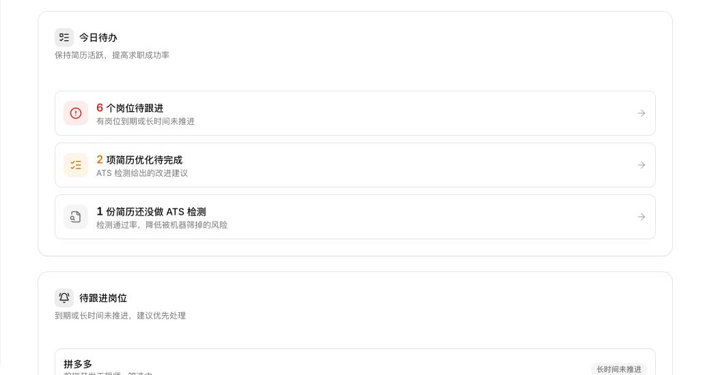
    </td>
    <td width="50%">
      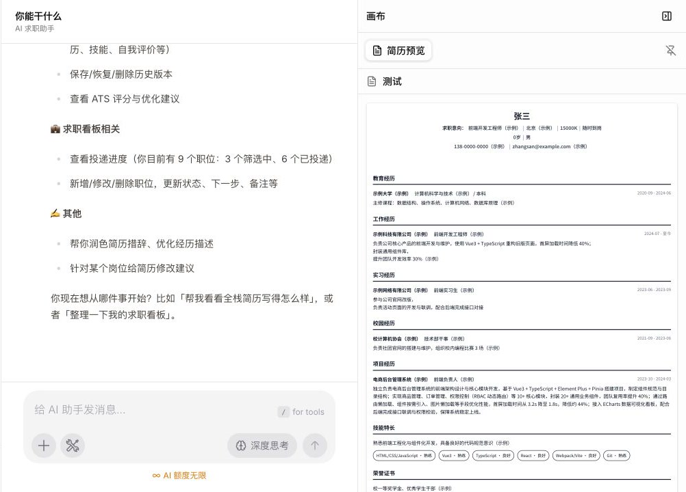
    </td>
  </tr>
  <tr>
    <td align="center"><sub><strong>Dashboard</strong> — 把简历优化、投递进度和下一步动作汇总到一个入口</sub></td>
    <td align="center"><sub><strong>AI Workspace</strong> — 对话、工具调用、变更记录和简历画布并排协作</sub></td>
  </tr>
</table>

> 截图来自本地开发环境；示例简历中的姓名、联系方式和求职记录均为演示数据。

### 常见问题

<details>
<summary><strong>本地数据会自动同步到其他设备吗？</strong></summary>

不会。IndexedDB 中的数据属于当前浏览器环境。需要跨设备使用时，应登录并确认云同步已经完成；清理浏览器数据、重装系统或更换设备前不要假设本地内容已经备份。

</details>

<details>
<summary><strong>修改简历后，已发送的分享链接会跟着变化吗？</strong></summary>

不会。分享使用固定快照，保证接收方看到的是创建链接时选择的版本。需要更新内容时，应创建或更新一个明确的新快照。

</details>

<details>
<summary><strong>为什么导出的 Word 和预览略有不同？</strong></summary>

浏览器、操作系统、Word 版本和本机字体都会影响排版。交付前应在目标软件中重新检查分页、字体替换、项目符号和链接。

</details>

---

<a id="engineering"></a>

## Part II — Engineering

### 架构概览

GResume 把高频编辑路径放在浏览器内：页面动作进入 Zustand 领域状态，Tiptap 与模板运行时负责编辑和呈现，IndexedDB 与 Automerge 保存本地文档。即使用户尚未登录，核心写作流程也不需要等待云端往返。

登录后，Supabase 提供身份、受 RLS 约束的数据、Realtime 与 Edge Functions。分享、评论、维护任务和模型请求等需要服务端能力的流程统一进入对应函数；DeepSeek 密钥只存在于服务端环境中，不进入浏览器构建产物。

<p align="center">
  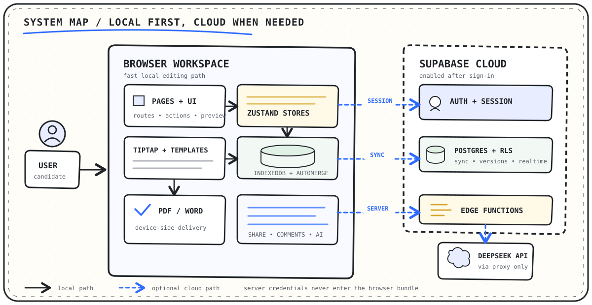
</p>

#### 数据放在哪里

| 数据类型                          | 主要位置                     | 说明                                                  |
| --------------------------------- | ---------------------------- | ----------------------------------------------------- |
| 未登录简历文档                    | 浏览器 IndexedDB / Automerge | 适合立即编辑；不自动跨设备出现                        |
| 登录后的简历、版本与 Tracker 数据 | Supabase PostgreSQL          | 由会话和 RLS 控制访问范围                             |
| 结构化与富文本协作状态            | Automerge + Yjs + Realtime   | 两套 CRDT 分别处理表单与富文本，Realtime 负责消息传输 |
| 分享与评论                        | PostgreSQL + Edge Functions  | 函数负责访问令牌、快照、评论和特权流程                |
| AI 请求                           | `llm-proxy` Edge Function    | 浏览器发送所需上下文，服务端携带模型密钥请求 DeepSeek |
| PDF / Word                        | 用户设备                     | 从当前选择的简历版本生成并下载                        |

#### 一次“岗位定制并分享”的时序

<p align="center">
  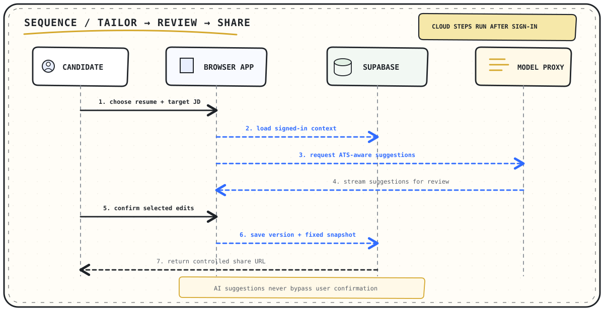
</p>

时序图中的云端消息只在已登录且相应能力可用时发生。未登录编辑不会向 DeepSeek 发起请求；AI 返回的是建议或待确认的工具结果，不应绕过用户确认直接改写简历。

### 产品能力如何落到代码

| 产品能力             | 内部机制与职责边界                                                                | 主要实现位置                                                                                                                                                                                                                                                                                  |
| -------------------- | --------------------------------------------------------------------------------- | --------------------------------------------------------------------------------------------------------------------------------------------------------------------------------------------------------------------------------------------------------------------------------------------- |
| 本地编辑与云同步     | Store 管理表单状态；Automerge 管理结构化文档；离线管理器处理 IndexedDB 简历       | [`src/store/resume`](./src/store/resume/)、[`src/lib/automerge`](./src/lib/automerge/)、[`offline-resume-manager.ts`](./src/lib/offline-resume-manager.ts)                                                                                                                                    |
| JD 版本与 ATS        | 派生流程保存父子血缘和变更；ATS 根据实际存在的内容构造评估输入并归一化模型结果    | [`src/store/jd-variant`](./src/store/jd-variant/)、[`src/lib/ats`](./src/lib/ats/)、[`jd-variant.ts`](./src/lib/llm/prompts/jd-variant.ts)                                                                                                                                                    |
| 模板、预览与导出     | 模板 registry / runtime 负责呈现；分页层只处理 DOM 几何和页面分段；导出层生成文件 | [`src/lib/resume-template`](./src/lib/resume-template/)、[`src/components/resume/pagination`](./src/components/resume/pagination/)、[`export.ts`](./src/store/resume/export.ts)                                                                                                               |
| 历史、分享与全文审阅 | 历史层保存版本；分享层发布固定 Release；评论层维护版本作用域、锚点和有序事件      | [`src/lib/supabase/resume/history`](./src/lib/supabase/resume/history/)、[`share.ts`](./src/lib/supabase/resume/share.ts)、[`src/features/resume-comments`](./src/features/resume-comments/)                                                                                                  |
| AI 助手              | Agent Loop 组织模型与工具轮次；工具层执行读写边界；`llm-proxy` 保存密钥并收口额度 | [`src/lib/ai/agent`](./src/lib/ai/agent/)、[`src/lib/ai/tools`](./src/lib/ai/tools/)、[`llm-proxy`](./supabase/functions/llm-proxy/index.ts)                                                                                                                                                  |
| 求职 Tracker         | 页面 Store 管理看板交互；`company` 数据记录职位、阶段、联系人、活动与关联简历     | [`src/pages/tracker`](./src/pages/tracker/)、[`company` 初始迁移](./supabase/migrations/20260220021810_company.sql)、[下一步日期](./supabase/migrations/20260728000002_add_company_next_action.sql)、[活动与联系人](./supabase/migrations/20260728000003_add_company_activities_contacts.sql) |

这张表描述职责边界，不代表调用顺序。下面的 Deep Dive 只展开那些对数据一致性、可恢复性或交付结果有直接影响的机制。

### 技术栈

<p align="center">
  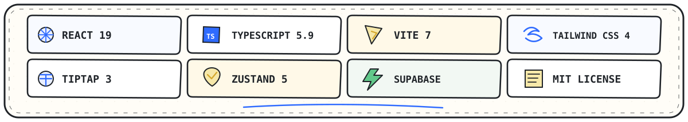
</p>

| 层级         | 核心技术                                          | 在项目中的职责                                       |
| ------------ | ------------------------------------------------- | ---------------------------------------------------- |
| Web 基础     | React 19、TypeScript 5.9、Vite 7                  | 页面、类型系统、文件路由与构建                       |
| 视觉与交互   | Tailwind CSS 4、Radix UI、Base UI、Motion、Lucide | 主题、无障碍组件、动效与图标                         |
| 简历编辑     | Tiptap 3、模板 registry / runtime                 | 结构化内容编辑、模板解析、预览与呈现                 |
| 状态管理     | Zustand 5                                         | 应用级状态、页面级领域状态和业务动作                 |
| 本地优先数据 | IndexedDB、Automerge                              | 浏览器持久化、结构化简历文档与冲突合并               |
| 实时协作     | Automerge Repo、Yjs、Tiptap、Supabase Realtime    | 表单与富文本双引擎、协作会话、光标和实时事件         |
| 云端后端     | Supabase Auth、PostgreSQL、RLS、Edge Functions    | 身份、数据隔离、分享、评论和服务端流程               |
| AI           | AI SDK 6、OpenAI SDK 类型/流工具、DeepSeek API    | 兼容 OpenAI 协议的类型、SSE 解析、工具调用和模型代理 |
| 数据校验     | Zod 4                                             | 简历、模板、ATS 与工具输入的运行时校验               |
| 文档交付     | `docx`、浏览器打印                                | Word 生成与 PDF 输出                                 |
| 工程质量     | ESLint、TypeScript、pnpm                          | 静态检查、类型检查和依赖管理                         |

这里的技术栈只列出会影响系统边界和开发方式的主要依赖；完整且可执行的版本以 [`package.json`](./package.json) 和 [`pnpm-lock.yaml`](./pnpm-lock.yaml) 为准。

### 双 CRDT 协作引擎：Automerge + Yjs + Supabase Realtime

简历编辑器同时存在两种不同的写入形态：结构化表单修改的是公司名称、时间范围、项目列表等有明确路径的字段；Tiptap 富文本修改的是连续文本片段、选区和光标状态。Automerge 与 Yjs 都能表达结构和文本；这里采用双引擎，是为了延续项目已有的 Automerge Repo 文档模型，同时复用 Tiptap Collaboration 的 Yjs 适配与 Awareness 生态，并让表单状态和编辑器状态的同步边界保持清晰。

GResume 因此采用双 CRDT：Automerge 管理结构化简历文档，Yjs 管理富文本片段和 Awareness。Supabase Realtime 只作为传输层，项目分别实现 Automerge `NetworkAdapter` 与 Yjs Provider，不把 Realtime 广播误当成持久化数据库。

<p align="center">
  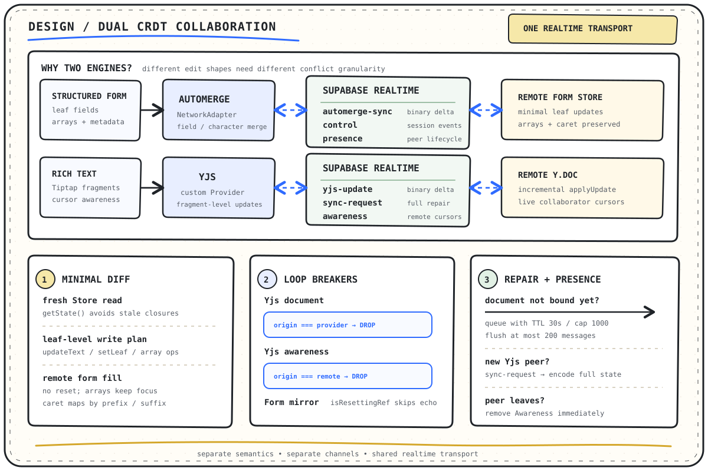
</p>

#### 为什么拆成两个引擎

| 编辑对象                         | 引擎              | 合并粒度             | 选择原因                                                |
| -------------------------------- | ----------------- | -------------------- | ------------------------------------------------------- |
| 基本信息、经历、技能、配置和数组 | Automerge         | 字段、字符和数组操作 | 数据有稳定路径，适合用 CRDT 文档表达结构关系与并发写入  |
| Tiptap 富文本片段                | Yjs               | 富文本增量           | 能直接连接 Tiptap Collaboration，并维护选区与 Awareness |
| 在线成员与实时消息               | Supabase Realtime | 广播、Presence       | 提供已登录会话中的低延迟传输，不承担 CRDT 冲突解析      |

两条同步链路使用独立频道：

| 通道                                      | 消息                | 作用                                                              |
| ----------------------------------------- | ------------------- | ----------------------------------------------------------------- |
| `automerge:resume:<resumeId>:<sessionId>` | `automerge-sync`    | 把 Automerge 二进制增量编码为 Base64 后发送给目标 peer            |
| 同上                                      | `automerge-control` | 传输加入、交接等协作控制事件                                      |
| 同上                                      | Presence            | 发现 peer、维护连接状态和成员元数据                               |
| `yjs:resume:<resumeId>:<sessionId>`       | `yjs-update`        | 传输 Yjs 二进制增量并应用到远端 `Y.Doc`                           |
| 同上                                      | `yjs-sync-request`  | 新 peer 请求完整状态，用 `encodeStateAsUpdate` 补偿漏掉的历史增量 |
| 同上                                      | `yjs-awareness`     | 同步选择区、光标和协作者状态                                      |

#### 冲突治理与回环阻断

- **每次写入现读 Store。** 表单订阅回调通过 `useResumeStore.getState()` 取得最新基线，再计算本地表单与 CRDT 状态的差异，避免 React 闭包持有旧快照后覆盖其他协作者刚写入的字段。
- **只写实际变化的叶子。** Diff 被翻译为 `updateText`、`setLeaf`、`arrayPush` 或 `arrayDeleteAt`；自由文本可以进行字符级合并，富文本、枚举和日期等原子字段保持明确的赋值语义。
- **远端填充不重置整个表单。** 数组使用不抢焦点的 append/remove；当前聚焦文本按公共前缀和后缀映射新光标位置，避免远端更新导致字段数组重建或输入光标跳到末尾。
- **来源标记阻断二次广播。** Yjs 文档用 `origin === provider` 跳过远端回写；Awareness 用 `origin === 'remote'` 跳过回声；表单镜像用 `isResettingRef` 阻断“远端填充 → 本地订阅 → 再次广播”。
- **未绑定文档先有限暂存。** Automerge 文档 ID 尚未就绪时，消息按 30 秒 TTL、1000 条容量上限暂存，每次最多冲刷 200 条，避免初始化竞态演变成无限内存队列。
- **离线立即清理幽灵光标。** Yjs peer 离开 Presence 后直接移除对应 Awareness，不等待协议默认超时；新加入者则主动发送 `sync-request` 修复可能遗漏的内容。

主要实现位于 [`supabase-network-adapter.ts`](./src/lib/automerge/collaboration/supabase-network-adapter.ts)、[`supabase-yjs-provider.ts`](./src/lib/collaboration/richtext/supabase-yjs-provider.ts)、[`use-resume-form-sync.ts`](./src/hooks/collab/use-resume-form-sync.ts) 和 [`use-form-remote-sync.ts`](./src/hooks/use-form-remote-sync.ts)。

### 流式 Agent 与受控写入：DeepSeek + Tool Calling + Zod + Edge Function

AI 助手不是一次请求、一次回答的薄封装。它运行一个最多 8 步的 Agent Loop：模型可以先分析，再读取简历或 Tracker，基于工具结果继续思考，最后给出文字结果或准备一个待确认的写操作。循环会在每步开始前检查取消状态，并用 `AbortSignal` 中止当前模型请求与 SSE 读取；工具执行和确认桥目前不接收 signal，若取消发生在该阶段，循环会在本轮工具全部返回后的下一次模型步骤开始前停止。

<p align="center">
  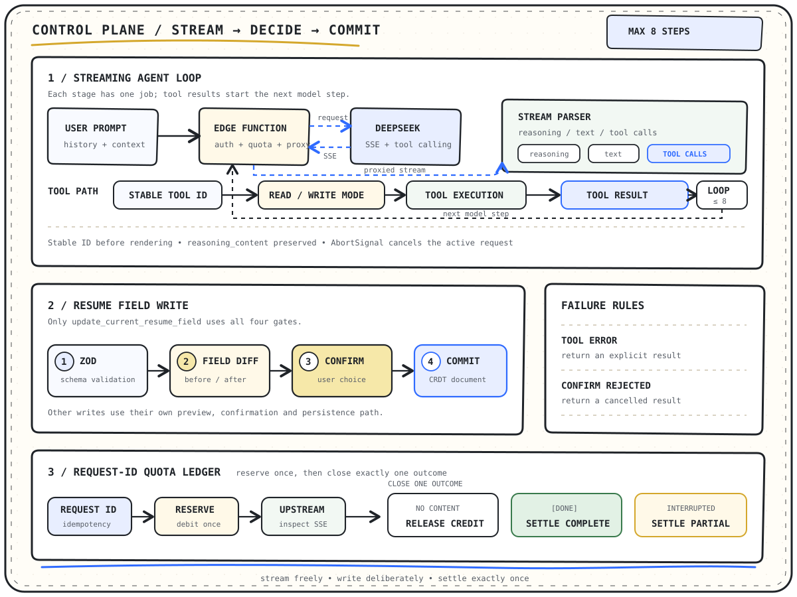
</p>

#### 一轮 Agent 如何执行

1. 客户端把对话历史、当前任务上下文和工具 JSON Schema 发送到 `llm-proxy` Edge Function。
2. Edge Function 校验用户、来源、请求体、模型和额度，再使用仅存在于服务端的密钥请求 DeepSeek。
3. `StreamParser` 分别累积 `reasoning_content`、普通文本、按 index 分片的 `tool_calls` 和 usage，不假设一个 SSE chunk 就是一条完整消息。
4. 只有工具名称与稳定 `toolCallId` 都已到达时，界面才显示工具占位，避免临时 index 与最终 ID 不一致产生重复记录。
5. read 工具可以直接执行；write 工具进入确认桥，工具结果再作为 `role=tool` 消息送入下一轮。
6. DeepSeek 思考模式的后续工具轮次会带回上一轮 `reasoning_content`，满足上游协议要求，避免多轮工具链在第二次请求时返回 400。

工具不存在、执行异常和确认卡拒绝都会转换成明确的 tool result，进入同一消息历史；达到 8 步仍未结束时，助手返回当前进展，而不是无限循环。

#### 写操作如何分层

工具注册表用 `read` / `write` 区分副作用：read 工具直接执行；write 工具在界面进入待确认态，真正的持久化逻辑放在 `requestConfirm` 的 `apply` 回调中。模型只负责提出参数，不能自行调用数据库或绕过确认。

下面四道门专属于 `update_current_resume_field` 的简历字段写入链路，并不代表 Tracker、CRUD 和版本工具也通过 Automerge：

| 门禁           | 做什么                                                                      | 阻止什么问题                                           |
| -------------- | --------------------------------------------------------------------------- | ------------------------------------------------------ |
| Zod 运行时校验 | 将模型给出的模块内容合并到当前数据，标准化后使用对应简历 schema `safeParse` | 错误对象结构、非法枚举、空标签和无法渲染的数据进入文档 |
| 字段级 Diff    | 按稳定 `entryId` 配对列表项，展示新增、删除和修改字段                       | 用户只能看到“AI 修改了内容”，却无法判断影响范围        |
| 用户确认       | write 工具通过确认桥挂起，确认卡展示 before / after                         | 模型在后台静默修改简历或求职记录                       |
| Automerge 提交 | 确认后才调用文档写入并持久化                                                | AI 绕过编辑器状态直接改数据库，造成画布与数据源分叉    |

其他 write 工具使用与操作类型匹配的摘要或 before / after 预览，经用户确认后再调用各自的服务层或 Store 完成职位、简历元信息和历史版本写入。

#### Edge Function 如何收口流式计费

`llm-proxy` 用服务端生成或透传的 `request_id` 原子预留额度；同一请求重放不会重复扣减，参数不一致的重放会被拒绝。之后根据内容是否已经交付走三种结局：

- **尚未交付：** 上游鉴权失败、超时、空响应或首段内容前中断时释放预留额度。
- **完整交付：** 收到有意义的 SSE 内容并最终收到 `[DONE]` 后，以 usage、finish reason 和上游请求 ID 完整结算。
- **部分交付：** 内容已经开始发送，但客户端取消或流中断时记录 `partial` 并结算，避免“用户已经获得内容但额度被错误返还”。

Edge Function 同时限制请求体、模型、消息数、工具数量、超时时间和允许来源；浏览器永远拿不到 DeepSeek 密钥或 Supabase service role key。

主要实现位于 [`agent-loop.ts`](./src/lib/ai/agent/agent-loop.ts)、[`stream-parser.ts`](./src/lib/ai/agent/stream-parser.ts)、[`resume.ts`](./src/lib/ai/tools/resume.ts) 和 [`llm-proxy`](./supabase/functions/llm-proxy/index.ts)。

### 确定性 A4 分页：TreeWalker + Range ClientRects + ResizeObserver

简历分页不能只用“内容高度除以页面高度”。字体尚未加载、富文本一行换成两行、图片完成解码或 SVG 尺寸变化，都会让基于估算的分页发生跨页截断。GResume 的分页器直接测量最终 DOM，并且只有在布局连续稳定后才提交分页结果。

<p align="center">
  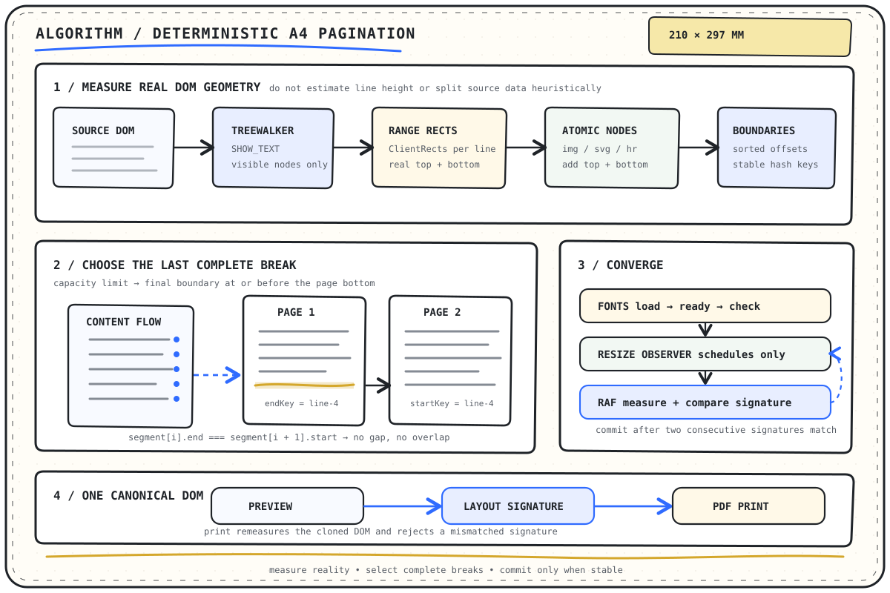
</p>

#### 从 DOM 生成完整断点

1. 用 `TreeWalker` 的 `SHOW_TEXT` 枚举可见文本节点，过滤空文本、隐藏节点和不参与布局的内容。
2. 对每个文本节点创建 `Range`，通过 `getClientRects()` 得到浏览器实际排出的每一行上下边界，而不是依赖 CSS `line-height` 推算。
3. 把 `[data-pagination-atomic]`、图片、SVG 和分隔线的顶部、底部加入候选，让分页器感知这些元素的完整几何区间。当前实现仍会收集其后代文本行，因此这是一组额外候选边界，还不是严格的 `keep-together` 保证。
4. 候选边界按纵向 offset 排序、去除 0.5px 内的重复值，并用 DOM 路径、文本和行号生成稳定 boundary key。
5. 每一页都选择页面容量内最后一个完整断点；下一段必须从同一个 offset 开始。算法会显式校验所有分段无缺口、无重叠，没有合法断点时直接报错而不是裁断文字。

#### 什么时候可以认为布局稳定

分页测量前先对当前字体的全部实际字重执行 `document.fonts.load`、等待 `document.fonts.ready`，再用 `document.fonts.check` 确认字体已经注册。`ResizeObserver` 只负责调度重测，不直接提交布局；真正的测量在连续 `requestAnimationFrame` 中完成。

每次测量都会生成布局签名：

```text
page width + page height + content height + font family + every page boundary key
```

连续两帧签名完全相同才进入 `ready`；最多尝试 8 帧，仍不稳定则显示分页错误。这样既能响应字体和容器变化，也不会让 ResizeObserver 的高频回调把半稳定结果提交给用户。

#### 为什么预览和 PDF 更接近

页面预览使用 `CanonicalPagedDocument` 渲染同一份 DOM 的裁切分段。打印时克隆这份 DOM、重新等待字体并再次计算分页签名；只有打印签名与预览签名一致才调用浏览器打印。两条链路不各自实现一套分页规则，因此减少异步字体造成的跨页截断和打印漂移。

主要实现位于 [`utils.ts`](./src/components/resume/pagination/utils.ts)、[`use-pagination-plan.ts`](./src/components/resume/pagination/use-pagination-plan.ts)、[`canonical-paged-document.tsx`](./src/components/resume/pagination/canonical-paged-document.tsx) 和 [`use-resume-print.ts`](./src/components/resume/pagination/use-resume-print.ts)。

### 跨版本全文审阅：Grapheme 锚点 + 上下文指纹 + 事件补偿

评论锚点不能只保存 DOM Range。编辑器重新渲染、简历分页变化或正文在评论前插入一个字，都可能让原 Range 失效；直接保存 UTF-16 offset 还会把 emoji、组合音标或某些东亚字符序列切到错误位置。

GResume 将正文、历史快照和公开分享都绑定到稳定 `version_id`，再为每个版本维护 canonical 评论作用域。不同版本的评论彼此隔离；同一个公开 Release 如果指向同一版本，则复用该版本作用域，而不是为相同内容复制另一套评论状态。

<p align="center">
  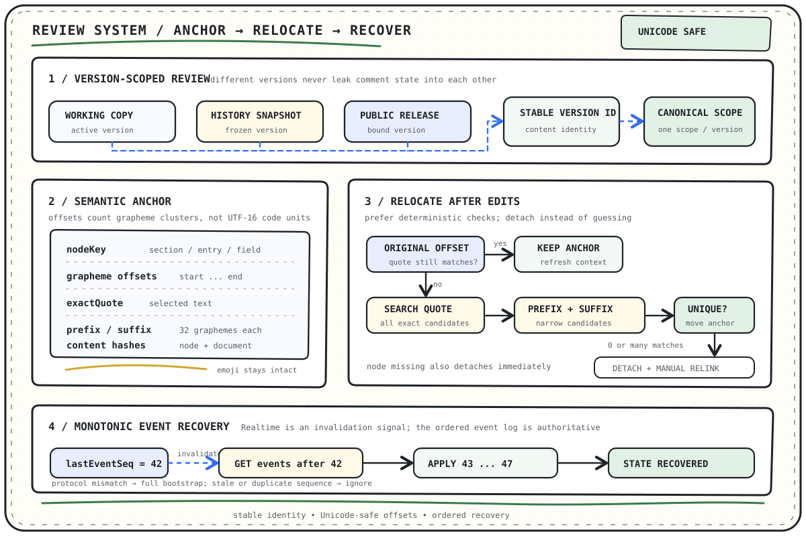
</p>

#### 锚点保存什么

| 字段                                        | 作用                                                                |
| ------------------------------------------- | ------------------------------------------------------------------- |
| `nodeKey`                                   | 用 `section / entry / field` 标识语义节点，不依赖当前 DOM 层级      |
| `startGraphemeOffset` / `endGraphemeOffset` | 使用 Unicode Grapheme 集群计数，避免 UTF-16 把 emoji 或组合字符拆开 |
| `exactQuote`                                | 保存用户真正选中的原文，用于编辑后重新搜索                          |
| `prefix` / `suffix`                         | 保存选区前后各最多 32 个 Grapheme，作为候选消歧上下文               |
| `nodeTextHash`                              | 判断当前节点正文是否变化                                            |
| `createdAtContentHash`                      | 记录创建或迁移时的完整评论文档版本                                  |

评论文档是从结构化简历投影出的稳定节点列表。它还保存 block ordinal，使跨富文本块选区可以重新映射到真实 DOM Range；哈希用于一致性校验，不被当成唯一定位依据。

#### 编辑后如何重定位

1. 先检查原 `nodeKey` 是否仍存在；节点已经删除时直接脱落。
2. 在原 Grapheme offset 校验 `exactQuote`。仍匹配时保留位置，只刷新上下文与哈希。
3. 原位置失效时，在同一节点搜索全部 exact quote 候选。
4. 使用 prefix / suffix 上下文指纹缩小候选；只有唯一候选才自动迁移。
5. 没有匹配或存在多解时标记为 detached，交给用户人工重连，不根据“最近位置”猜测。

工作副本持久化后会单独调度评论文档同步；评论同步失败只影响评论通道，不把已经成功的简历保存回滚成失败。Edge Function 计算已锚定线程的迁移或脱落，再把新评论文档、revision 和重定位结果交给同一个数据库 RPC 事务提交。

#### Realtime 漏事件如何补偿

评论 Realtime 广播只发送带单调 `event_seq` 的失效通知，完整事件日志仍保存在服务端。客户端维护 `lastEventSeq`：收到更大的序号后，请求 `afterEventSeq=<lastEventSeq>`，按升序拉取并应用缺失事件；旧序号和重复通知直接忽略。协议版本不兼容或日志不可用时才执行完整 bootstrap。

因此即使广播丢包、页面短暂离线或访问令牌轮换，评论状态仍能从有序事件日志恢复；本地缓存与已读游标只作为加速和离线体验，不会覆盖更新的服务端序号。

主要实现位于 [`selection.ts`](./src/features/resume-comments/anchors/selection.ts)、[`resume-comment-core.ts`](./supabase/functions/shared/resume-comment-core.ts)、[`use-comment-realtime.ts`](./src/features/resume-comments/hooks/use-comment-realtime.ts) 和 [`resume-comments`](./supabase/functions/resume-comments/index.ts)。

---

### 项目结构

```text
resume/
├── docs/assets/readme/          # README 手绘 SVG 与产品截图
├── public/                      # 应用图标、字体和第三方许可证说明
├── src/
│   ├── components/              # 跨页面复用的 UI 与基础组件
│   ├── features/                # 评论等按领域组织的功能模块
│   ├── hooks/                   # 跨页面 Hooks
│   ├── lib/                     # ATS、AI、协作、Supabase、模板等核心能力
│   ├── pages/                   # Dashboard、简历、模板、分享、AI、Tracker 等页面
│   ├── store/                   # 应用级与领域级 Zustand stores
│   └── utils/                   # 通用工具函数
├── supabase/
│   ├── functions/               # 分享、评论、模型代理、缓存与运维函数
│   ├── migrations/              # PostgreSQL 结构、RLS 与 RPC 迁移
│   └── tests/                   # Supabase 数据库验证
├── package.json                 # 命令、依赖与 pnpm 版本
├── vite.config.ts               # Vite、MDX、Tailwind 和分包配置
└── vercel.json                  # SPA 重写与部署响应头
```

页面通常把 UI、hooks、常量、类型、工具和页面级 store 放在对应目录中。跨页面共享的数据进入 `src/store/` 或 `src/lib/`，只服务单个组件的临时界面状态保留在组件内部。

---

### 配置与自托管

[快速开始](#快速开始)中的三个浏览器变量足以启动前端。完整云端能力还需要 Supabase CLI、目标项目、数据库迁移、Edge Functions 和 DeepSeek API key。

这里的“自托管”指自行部署 GResume 前端，并管理它所连接的 Supabase 项目；不包含用 Docker 运行整套 Supabase 平台的操作手册。

#### 前端配置

| 变量                                     | 必需性 | 说明                                                   |
| ---------------------------------------- | ------ | ------------------------------------------------------ |
| `VITE_SUPABASE_URL`                      | 必需   | Supabase 项目 URL；客户端初始化和云端请求都会使用      |
| `VITE_SUPABASE_PUBLISHABLE_KEY`          | 必需   | 可公开的 publishable / anon key；权限仍必须由 RLS 控制 |
| `VITE_BASE_URL`                          | 建议   | 应用基地址，用于认证回调或分享链接                     |
| `VITE_RESUME_COMMENTS_FUNCTION_REGION`   | 可选   | 评论函数区域；未设置时由客户端自动解析                 |
| `VITE_COLLABORATION_PROTOCOL_V2_ENABLED` | 可选   | 协作协议 v2 开关；当前默认关闭                         |

所有 `VITE_` 变量都会进入浏览器构建产物。这里只能放允许公开的客户端配置，不能放 service role key、DeepSeek key 或评论签名密钥。

#### 前端生产部署

运行 `pnpm build` 后，静态资源位于 `dist/`。部署平台需要把未知路径回退到 `index.html`，否则直接访问 `/resume/editor`、`/tracker` 等 BrowserRouter 路由会返回 404；仓库中的 [`vercel.json`](./vercel.json) 已提供 Vercel rewrite 示例。`VITE_` 变量在构建时写入产物，应在生产构建前配置完成。

#### Supabase 云端能力

仓库中的 `supabase/migrations/`、`supabase/functions/` 和 `supabase/config.toml` 描述数据库与函数配置。部署云端能力时，需要将迁移应用到目标项目，并按实际启用范围部署 Edge Functions。`resume-share`、`resume-comments` 和 `llm-proxy` 服务于用户可见的核心流程；`github-stars-refresh` 与 `backend-ops-monitor` 属于可选运维能力。

下列值应配置为 Supabase secrets，不能写进前端环境文件：

| Secret                                      | 使用场景                                                                           |
| ------------------------------------------- | ---------------------------------------------------------------------------------- |
| `SUPABASE_URL`、`SUPABASE_SERVICE_ROLE_KEY` | Supabase 托管的 Edge Functions 会自动注入；不要暴露给浏览器                        |
| `OPENAI_API_KEY`                            | 兼容旧变量名；当前必须填写 DeepSeek API key，供 `llm-proxy` 请求 `deepseek-v4-pro` |
| `RESUME_COMMENT_TOKEN_SECRET`               | 评论访问令牌签名                                                                   |
| `RESUME_COMMENT_COLLABORATOR_SECRET`        | 协作者凭据保护                                                                     |
| `RESUME_COMMENT_ANONYMOUS_PEPPER`           | 匿名评论身份派生                                                                   |
| `RESUME_COMMENT_REALTIME_SECRET`            | 评论实时通道保护                                                                   |
| `BACKEND_MAINTENANCE_TOKEN`                 | 可选；后端维护与缓存刷新任务鉴权                                                   |
| `GITHUB_TOKEN`                              | GitHub stars 缓存刷新                                                              |
| `OPS_ALERT_WEBHOOK_URL`                     | 后端运维告警 Webhook                                                               |
| `COLLABORATION_LEGACY_REGISTER_CUTOFF_AT`   | 旧协作注册流程的截止时间                                                           |

#### 最小远端部署流程

以下命令以 Supabase 托管项目为目标；执行前请先阅读官方的[环境管理](https://supabase.com/docs/guides/deployment/managing-environments)、[函数部署](https://supabase.com/docs/guides/functions/deploy)和[函数密钥](https://supabase.com/docs/guides/functions/secrets)说明。

1. 登录 CLI 并把仓库链接到目标项目：

   ```bash
   supabase login
   supabase link --project-ref <project-ref>
   ```

2. 检查并应用仓库中的数据库迁移：

   ```bash
   supabase db push --dry-run
   supabase db push
   supabase migration list
   ```

3. 把服务端密钥写入已被 `.gitignore` 排除的 `supabase/functions/.env`，再上传到目标项目：

   ```dotenv
   # 变量名为历史兼容命名，值必须是 DeepSeek API key
   OPENAI_API_KEY=your-deepseek-api-key
   RESUME_COMMENT_TOKEN_SECRET=replace-with-a-long-random-secret
   RESUME_COMMENT_COLLABORATOR_SECRET=replace-with-a-different-random-secret
   RESUME_COMMENT_ANONYMOUS_PEPPER=replace-with-a-different-random-secret
   RESUME_COMMENT_REALTIME_SECRET=replace-with-a-different-random-secret
   ```

   ```bash
   supabase secrets set --env-file supabase/functions/.env
   supabase secrets list
   ```

   `BACKEND_MAINTENANCE_TOKEN`、`GITHUB_TOKEN` 和 `OPS_ALERT_WEBHOOK_URL` 只在启用对应运维流程时设置；不要把真实值粘贴到 README、Issue 或终端截图中。

4. 部署核心 Edge Functions：

   ```bash
   supabase functions deploy resume-share
   supabase functions deploy resume-comments
   supabase functions deploy llm-proxy
   ```

   GitHub stars 缓存和后端告警不是核心流程。需要时再部署：

   ```bash
   supabase functions deploy github-stars-refresh
   supabase functions deploy backend-ops-monitor
   ```

   仅部署这两个函数不会启用定时调用。若要开启运维任务，先把同一个、至少 32 位的维护令牌同时设置为 Edge secret `BACKEND_MAINTENANCE_TOKEN` 和 Vault secret `resume_backend_maintenance_token`，再写入项目 URL 并打开数据库开关：

   ```bash
   supabase secrets set BACKEND_MAINTENANCE_TOKEN=replace-with-the-same-long-random-token
   ```

   ```sql
   select vault.create_secret(
     'https://your-project-ref.supabase.co',
     'resume_backend_project_url'
   );
   select vault.create_secret(
     'replace-with-the-same-long-random-token',
     'resume_backend_maintenance_token'
   );
   select private.set_backend_maintenance_flags_v1(true, true);
   ```

   `cleanup_enabled` 与 `edge_jobs_enabled` 默认均为 `false`。不启用可选运维任务时保持默认即可；凭据轮换或重复配置前，先在 Vault 中更新已有同名 secret，不要重复创建。

5. 在 Supabase Dashboard 的 **Authentication → URL Configuration** 中，把生产站点设为 Site URL，并将实际使用的认证回调加入 Redirect URLs；当前编辑器路由是 `http://localhost:5173/resume/editor` 与生产环境的 `<VITE_BASE_URL>/resume/editor`。最后使用普通用户完成登录、分享和 AI 请求的 smoke 检查。

> **密码重置限制：** 当前忘记密码表单仍把回调构造为 `<VITE_BASE_URL>/editor`，但仓库没有 `/editor` 页面，也没有独立的 recovery 页面。自行部署前需要先统一回调路由并补齐恢复密码界面，再把同一个 URL 加入 Supabase Redirect URLs；在此之前不能把密码重置视为可交付能力。

### 开发与验证

开发环境由 [`.nvmrc`](./.nvmrc) 固定为 Node.js 24，由 `packageManager` 固定为 pnpm 10.33.3。

#### 前端命令

| 命令           | 作用                             |
| -------------- | -------------------------------- |
| `pnpm dev`     | 启动 Vite 开发服务器             |
| `pnpm build`   | 运行 Vite 生产构建并生成生产资源 |
| `pnpm preview` | 本地预览生产构建                 |
| `pnpm lint`    | 运行 ESLint                      |

#### 数据库合约

[`supabase/tests/database`](./supabase/tests/database/) 覆盖基础 RLS、AI 额度、评论并发、函数安全和后端维护合约。需要本机已安装 Supabase CLI，并能启动本地容器：

```bash
supabase start
supabase db reset --local
supabase test db --local
```

前端改动至少运行 `pnpm lint` 与 `pnpm build`；数据库、评论、协作或 Edge Function 改动还应执行与修改范围对应的本地合约和 smoke 检查。

---

### 安全说明

- 根目录被追踪的 `.env` 只能保存允许进入浏览器的 `VITE_` 公开配置；不要向其中加入任何密钥。个人环境优先使用已忽略的 `.env.local`，Edge Function 密钥使用已忽略的 `supabase/functions/.env`。
- 不要提交 service role key、DeepSeek key、维护令牌、评论/协作密钥或任何包含这些值的环境文件。
- 浏览器只能使用 Supabase publishable / anon key；授权边界由数据库 RLS 和服务端校验共同保证。
- 不要用“前端隐藏按钮”代替权限控制，也不要把 service role key 注入 `VITE_` 变量。
- 分享密码和有效期用于限制访问，但分享链接仍应按敏感资源管理；失去控制后应及时关闭或删除。
- 简历通常包含姓名、联系方式、教育和工作经历。提交 Issue、截图或日志前，请先删除个人信息和令牌。
- AI 请求会把完成任务所需的上下文发送到模型服务。自行部署者应根据自己的数据政策、地区要求和供应商条款决定是否启用。
- 发现安全问题时，不要在公开 Issue 中附带可利用细节、真实简历或密钥；请先通过维护者主页提供的联系方式私下沟通。

### 参与贡献

欢迎通过 [Issues](https://github.com/506-FETL/resume/issues) 提交可复现的问题、真实使用场景或范围清晰的改进建议。

1. Fork 仓库并从当前主线创建聚焦的功能分支。
2. 遵循现有 TypeScript、页面模块、状态管理、组件 primitive 和动效约定。
3. 在提交前运行与改动相关的验证，并至少执行 `pnpm build`。
4. Pull Request 中说明问题、方案、验证方式；界面变化请附截图或录屏。
5. 涉及迁移、RLS、Edge Functions、分享或协作协议时，说明数据和兼容性影响。

当前公开计划以 [GitHub Issues](https://github.com/506-FETL/resume/issues) 和仓库实际变更为准，README 不维护未经确认的发布日期或版本承诺。

---

### 许可证

本项目采用 [MIT License](./LICENSE)。你可以在保留版权和许可证声明的前提下使用、复制、修改、合并、发布和分发本项目；软件按“原样”提供，不附带保证。

---

### 维护者与致谢

GResume 由 [506-FETL](https://github.com/506-FETL) 维护。

已发布版本的功能变化记录在[产品更新日志](https://506resume.cc/changelog)；待处理问题和后续方向以 [GitHub Issues](https://github.com/506-FETL/resume/issues) 为准。

项目建立在 React、Tiptap、Zustand、Automerge、Yjs、Supabase、Tailwind CSS、AI SDK 等开源项目之上。字体、图标和组件的第三方许可证说明位于 [`public/licenses`](./public/licenses/)。

也感谢每一位提交 Issue、Pull Request、设计反馈和真实求职场景的贡献者。一个具体、可复现的问题，往往比一句“可以更好”更能推动项目向前。
