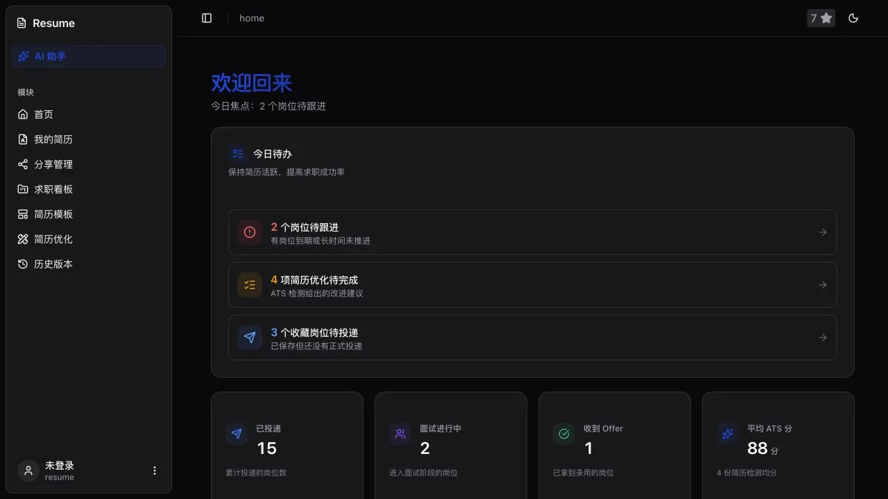

<div align="center">

# GResume

**从简历创作、岗位定制到投递跟进的一站式求职工作台。**


[](./LICENSE)

</div>

---

## 这是什么

GResume 为正在求职的人提供一条完整而连续的工作流：写好一份简历，针对目标岗位生成独立版本，安全地分享给招聘方，再持续跟进投递、面试与下一步行动。

你可以不注册直接在浏览器中开始编辑；登录后再启用云端同步、历史版本、协作、AI 优化和求职追踪。核心目标不是让你维护更多工具，而是让每一次投递都有明确版本、上下文和进展。

## 为什么需要它

真实的求职过程通常被拆散在文档、招聘网站、聊天记录和表格里。简历改了很多份，却说不清哪一份发给了谁；岗位进入面试后，联系人、反馈和下次跟进时间又散落在不同地方。

GResume 把这些信息放回同一条求职链路中，让简历内容、岗位版本和申请进度彼此关联，而不是成为一组孤立文件。

## 你会得到什么

### 写出更匹配岗位的简历

使用模块化编辑器、实时预览和多套模板完成基础简历；通过 ATS 五维分析、划词改写和 JD 派生，为不同岗位保留独立、可追溯的内容版本。

### 管理每一次对外投递

浏览和对比历史快照，按指定版本创建只读分享链接，并为链接设置名称、有效期、密码和启停状态。已经发出的内容不会因为后续编辑而意外变化。

### 持续推进求职进度

在看板或列表中管理岗位阶段、面试轮次、联系人、活动时间线和下一步跟进日期；Dashboard 会聚合待办、投递漏斗、ATS 趋势和近期动态。



## 工作方式

1. **Write** — 创建基础简历，用实时预览校准内容和排版。
2. **Tailor** — 粘贴目标 JD，生成独立的岗位定制版本并检查改写依据。
3. **Share** — 选择当前内容或历史版本，创建不会自动变化的只读链接。
4. **Track** — 记录投递、面试、联系人和下一步行动，让每个机会持续向前推进。

详细能力与当前边界见 [产品能力说明](./docs/product-capabilities.md)。

## 快速开始

环境要求：Node.js 24+、pnpm。

```bash
git clone https://github.com/506-FETL/resume.git
cd resume

corepack enable
pnpm install
pnpm dev
```

打开 `http://localhost:5173`。未配置 Supabase 时仍可使用离线简历编辑，数据保存在当前浏览器的 IndexedDB 中。

需要登录、云端同步、AI 助手、实时协作和外部分享时，请继续阅读 [自托管与部署](./docs/self-hosting.md)。

## 技术基础

GResume 使用 React 19、TypeScript、Vite 7 和 Tailwind CSS 4 构建界面；Zustand 管理应用状态，Tiptap 负责富文本编辑。离线文档基于 IndexedDB 与 Automerge，字符级协作使用 Yjs，云端能力由 Supabase Auth、PostgreSQL、Realtime 和 Edge Functions 提供。

AI 请求统一经过服务端代理，前端不持有模型密钥。PDF 与 Word 导出、版本快照和分享内容均基于同一份简历数据模型，减少编辑、预览与交付之间的内容偏差。

## 当前边界

- 离线模式适合本机编辑；云端历史、分享、协作和求职 CRM 需要登录并完成 Supabase 配置。
- AI 能力依赖已部署的 `llm-proxy` 与可用模型额度。
- AI 助手当前支持项目内部数据读取和确认后写入，不宣称支持联网搜索或图片理解。

## 参与贡献

欢迎提交 Issue 和 Pull Request。提交前请运行：

```bash
pnpm lint
pnpm build
```

## 许可证

GResume 使用 [MIT License](./LICENSE)。
