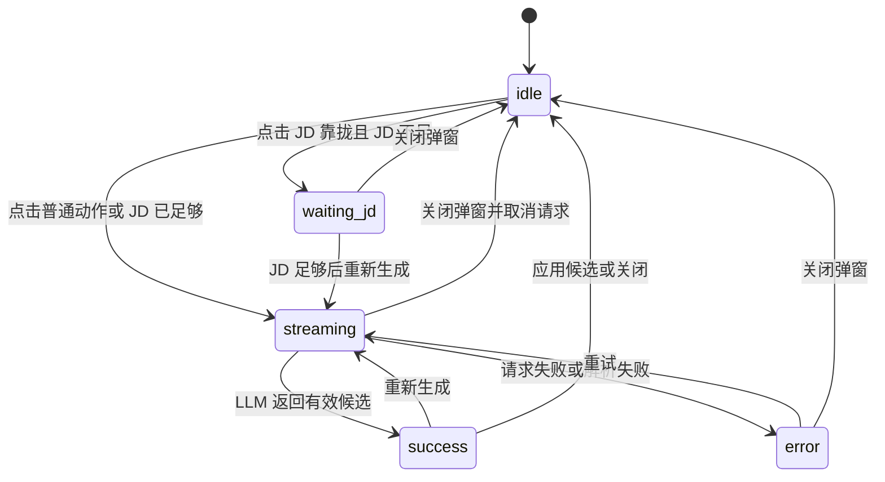

# AI Rewrite 模块讲解

`ai-rewrite` 是简历编辑器里的“划词改写”能力：用户在 Tiptap 富文本里选中一段内容，系统弹出改写动作菜单；用户选择动作后，模块把选区、字段上下文和可选 JD 交给 LLM；LLM 返回 2 到 3 个候选；用户选择一个候选后，组件把候选 HTML 写回原选区。

这个模块最重要的设计点是职责分层：

- `ai-rewrite-bubble.tsx` 负责串联 Tiptap、选区、会话状态和最终写回。
- `hooks/` 负责“怎么发请求、怎么保存 React 会话状态”。
- `utils/` 负责可测试或可独立复用的逻辑：读取 Tiptap 选区、状态转移、重试判断、LLM JSON 解析。
- `components/` 和展示组件只负责 UI，不直接碰 Tiptap editor，也不直接调用 LLM。

理解这个模块时，可以先记住一句话：

> `AiRewriteBubble` 是总控；`readRewriteSelection` 抓选区；`useAiRewrite` 调 LLM；`useRewriteSession` 管状态；`AiRewritePanel` 展示候选；`CandidateCard` 把选中的候选交回给总控写入 Tiptap。

## 目录结构

```text
src/components/ai-rewrite/
├── README.md
├── ai-rewrite-bubble.tsx
├── ai-rewrite-panel.tsx
├── ai-rewrite.scss
├── components/
│   ├── bubble-menu.tsx
│   ├── candidate-card.tsx
│   ├── candidate-list.tsx
│   ├── dialog-shell.tsx
│   ├── jd-context-input.tsx
│   ├── panel-footer.tsx
│   └── status-view.tsx
├── const.ts
├── hooks/
│   ├── use-ai-rewrite.ts
│   └── use-rewrite-session.ts
├── index.ts
├── types.ts
└── utils/
    ├── parse-rewrite-response.ts
    ├── read-rewrite-selection.ts
    └── rewrite-session-state.ts
```

## 文件逐个讲解

### `index.ts`

**作用：** 对外入口。

**实现思路：** 这个文件只做 barrel export：

- 导出 `AiRewriteBubble`，让 `SimpleEditor` 可以挂载划词改写能力。
- 导出 `types.ts` 里的类型，让外部表单能构造 `fieldContext`。

**在模块中的角色：** 它是模块边界。外部不应该直接依赖内部的 `hooks/`、`utils/`、`components/`，否则内部重构会影响调用方。

### `types.ts`

**作用：** 定义整个模块的业务语言。

**实现思路：** 把 AI 改写的关键数据结构集中定义：

- `RewriteAction`：用户能点的改写动作。
- `RewriteSectionKey`：当前内容属于简历哪个模块。
- `RewriteFieldContext`：调用方传进来的字段上下文。
- `RewriteSelection`：被选中的 Tiptap 内容快照。
- `RewriteCandidate`：LLM 返回的单个候选。
- `RewriteSessionState`：面板当前处于什么状态。

**在模块中的角色：** 它是所有文件共享的契约。只要这些类型清楚，组件之间就不需要互相知道内部实现。

### `const.ts`

**作用：** 放动作元信息和阈值。

**实现思路：**

- `REWRITE_ACTION_LIST` 决定菜单按钮顺序。
- `REWRITE_ACTION_META` 决定每个按钮的图标、标题和说明。
- `SELECTION_MIN_CHARS` 决定选区多短时不展示入口。
- `JD_MIN_CHARS` 决定 JD 靠拢动作何时允许生成。
- `REWRITE_TEMPERATURE` 供 LLM 请求层使用。

**在模块中的角色：** 它让“动作配置”和“业务阈值”不散落在各个 UI 文件里。新增一个 action 时，通常会同时改这里、`types.ts` 和 `src/lib/llm/prompts/rewrite.ts`。

### `ai-rewrite-bubble.tsx`

**作用：** 顶层总控组件，也是唯一直接操作 Tiptap editor 的组件。

**实现思路：**

1. 创建一个原生 DOM 容器，交给 Tiptap `BubbleMenuPlugin` 使用。
2. 注册 `BubbleMenuPlugin`，让用户选中文字时显示菜单。
3. 用户点击动作后，调用 `readRewriteSelection(editor)` 获取当前选区快照。
4. 把选区存进 `savedSelection`，避免弹窗打开后 selection 丢失。
5. 如果是 `align_jd` 且 JD 不够长，进入 `waiting_jd` 状态，不发请求。
6. 否则调用 `useAiRewrite().run(action, selection)` 发起 LLM 请求。
7. 组合弹窗 shell、footer 和 panel。
8. 用户点击候选后，用 `editor.chain().focus().insertContentAt(...).run()` 写回原选区。

**在模块中的角色：** 它是“桥”。一边连接 Tiptap，另一边连接 React UI 和 LLM session。为了保持边界清晰，候选怎么展示、错误怎么显示、LLM 怎么解析，都不放在这里。

### `ai-rewrite-panel.tsx`

**作用：** 弹窗 body 的组合层。

**实现思路：**

- 如果 session 还是 `idle`，或者没有 action/selection，直接不渲染。
- 如果 action 是 `align_jd`，先渲染 JD 输入框。
- 再渲染状态视图 `RewriteStatusView`。
- 最后渲染候选列表 `RewriteCandidateList`。

**在模块中的角色：** 它是一个“拼装容器”。它不关心 Tiptap 写回，不关心请求怎么发，只把当前 state 对应的 UI 组合出来。

### `ai-rewrite.scss`

**作用：** 给 BubbleMenu 原生挂载点补充必要样式。

**实现思路：** 目前只设置 `.ai-rewrite-bubble { z-index: 60; }`。

**在模块中的角色：** Tiptap BubbleMenuPlugin 要求传入一个原生 DOM element，这个 element 不走 shadcn 组件体系，所以这里保留极少量样式。其他弹层和候选 UI 都尽量用 shadcn/Tailwind。

### `components/candidate-card.tsx`

**作用：** 展示单个 LLM 候选。

**实现思路：**

- Card header 展示候选标题。
- Card content 渲染候选 HTML 和 notes。
- Card footer 放“应用此版本”按钮。
- 点击按钮时只把 `candidate` 往上抛。

**在模块中的角色：** 它是候选的最小展示单元。它不知道候选会写到哪里，也不操作 editor。真正写回选区的逻辑在 `AiRewriteBubble`。

### `components/bubble-menu.tsx`

**作用：** 渲染划词后出现的动作菜单。

**实现思路：**

- 遍历 `REWRITE_ACTION_LIST`。
- 从 `REWRITE_ACTION_META` 取 icon、label、description。
- 渲染 5 个按钮。
- 点击按钮时调用 `onAction(action)`。
- `onMouseDown` 阻止按钮抢走编辑器焦点，减少弹窗打开时的焦点问题。

**在模块中的角色：** 它只负责“用户想执行哪个动作”。它不读选区，不开弹窗，不发请求。

### `components/dialog-shell.tsx`

**作用：** 提供响应式弹窗外壳。

**实现思路：**

- 使用项目内的 `ResponsiveDialog`。
- header 固定展示 icon、title、description。
- 中间内容区给 `children`。
- footer 由外部传入。
- 通过 `min-h-0 flex-1` 保证 body 内部可以独立滚动。

**在模块中的角色：** 它是 UI 布局边界。它不知道 AI 改写，只保证弹窗结构稳定。

### `components/panel-footer.tsx`

**作用：** 渲染弹窗底部操作区。

**实现思路：**

- 当前只有“重新生成”按钮。
- `canRetry` 为 false 时禁用。
- `isStreaming` 为 true 时禁用，避免请求中重复触发。
- 点击后调用 `onRetry()`。

**在模块中的角色：** 它承载“再来一次”的操作，但不判断业务条件。业务条件由 `getRewriteCanRetry()` 算好后传进来。

### `components/status-view.tsx`

**作用：** 根据 session 状态展示空态、加载、错误和等待 JD。

**实现思路：**

- `streaming`：显示 loading。
- `waiting_jd`：提示先填写 JD。
- `error`：用 `Alert` 显示错误。
- `success` 且候选为空：显示“未生成有效候选”。
- 其他状态返回 `null`。

**在模块中的角色：** 它是状态展示层。它不改变状态，也不发起重试。

### `components/candidate-list.tsx`

**作用：** 渲染候选列表。

**实现思路：**

- 没有候选时返回 `null`。
- 有候选时使用响应式 grid。
- 每个候选交给 `CandidateCard`。

**在模块中的角色：** 它负责“候选如何排列”。候选怎么生成、怎么应用，都不属于它。

### `components/jd-context-input.tsx`

**作用：** `align_jd` 动作的 JD 输入区。

**实现思路：**

- 展示 `Textarea`。
- 计算 trimmed 字数。
- 展示当前字数和最低字数。
- 根据 `JD_MIN_CHARS` 设置 `aria-invalid`。
- 输入变化时调用 `onChange(value)`。

**在模块中的角色：** 它只收集 JD 草稿。草稿保存在哪里、是否允许重试，由 session 和 footer 控制。

### `utils/read-rewrite-selection.ts`

**作用：** 从 Tiptap editor 中读取当前选区。

**实现思路：**

1. 从 `editor.state.selection` 取 `from` 和 `to`。
2. 如果 `from === to`，说明没有选区，返回 `null`。
3. 用 `textBetween(from, to, '\n')` 取纯文本。
4. 如果文本过短，返回 `null`。
5. 用 `editor.state.doc.slice(from, to)` 获取 ProseMirror slice。
6. 用 `DOMSerializer.fromSchema(editor.schema)` 序列化出 HTML。
7. 返回 `{ from, to, text, html }`。

**在模块中的角色：** 它是 Tiptap 选区和 AI 改写请求之间的转换器。LLM 需要 `text/html`，Tiptap 写回需要 `from/to`，这四个值都在这里一次性固定下来。它不使用 React hook，所以放在 `utils/`，避免用 `use*` 命名误导读者。

### `hooks/use-rewrite-session.ts`

**作用：** React 状态容器。

**实现思路：**

- 用 `useState(INITIAL_REWRITE_SESSION_STATE)` 保存当前会话。
- 暴露一组语义化方法：`startStreaming`、`succeed`、`fail`、`reset`、`setJdDraft`、`waitForJd`。
- 每个方法内部都调用 `utils/rewrite-session-state.ts` 的纯函数完成状态转移。

**在模块中的角色：** 它把“React 状态保存”与“状态如何变化”分开。组件调用的是清晰动作，状态变化细节集中在 utils。

### `hooks/use-ai-rewrite.ts`

**作用：** 请求调度层。

**实现思路：**

1. 持有 `AbortController`。
2. 新请求开始前先 `cancel()` 旧请求。
3. 调用 `session.startStreaming(action)`。
4. 调用 `runBulletRewrite()`，传入 action、selection text、selection html、fieldContext 和可选 JD。
5. 请求成功后调用 `parseRewriteResponse()`。
6. 解析成功后 `session.succeed(candidates)`。
7. 请求或解析失败后 `session.fail(message)`。
8. 如果请求已 abort，则直接返回，不写入 error。

**在模块中的角色：** 它是 UI 和 LLM 的中间层。它不关心弹窗长什么样，也不操作 Tiptap editor，只负责把“一次改写请求”完整跑完。

### `utils/rewrite-session-state.ts`

**作用：** 纯状态机。

**实现思路：**

- `INITIAL_REWRITE_SESSION_STATE` 定义初始状态。
- `startRewriteStreaming()` 进入生成中，并清空候选和错误。
- `succeedRewriteSession()` 进入成功态并保存候选。
- `failRewriteSession()` 进入错误态并清空候选。
- `resetRewriteSession()` 回到初始态。
- `setRewriteJdDraft()` 更新 JD 草稿。
- `waitForRewriteJd()` 进入显式 `waiting_jd`。
- `getRewriteCanRetry()` 判断 footer 的“重新生成”是否可点。

**在模块中的角色：** 它是业务状态的核心。因为是纯函数，所以比 React hook 更容易测试，也更适合承载规则。

### `utils/parse-rewrite-response.ts`

**作用：** 解析和规整 LLM 返回结果。

**实现思路：**

1. 用 `parseLlmJsonObject()` 从字符串里提取 JSON 对象。
2. 读取 `candidates` 数组。
3. 过滤没有有效 `html` 的候选。
4. 处理 title：缺失时生成默认标题，重复时追加序号，最长 10 字。
5. 处理 notes：最多保留 200 字。
6. 有效候选少于 2 个时抛错。
7. 最多返回 3 个候选。

**在模块中的角色：** 它是 LLM 输出和 UI 候选之间的防腐层。UI 不直接信任模型输出，而是先经过这里校验、截断和规整。

## 整体链路：从划词到采用 LLM 建议

下面按真实执行顺序说明完整链路。

### 1. 富文本字段接入 AI Rewrite

简历表单里的富文本字段会使用 `SimpleEditor`。只有调用方传了 `fieldContext`，`SimpleEditor` 才会挂载：

```tsx
<AiRewriteBubble editor={editor} fieldContext={fieldContext} />
```

`fieldContext` 是 LLM 理解上下文的关键。它告诉模型：

- 当前正在编辑哪个简历模块。
- 当前字段叫什么。
- 用户求职意向是什么。

没有 `fieldContext` 的编辑器不会启用划词改写。

### 2. `AiRewriteBubble` 建立 Tiptap BubbleMenu

`AiRewriteBubble` 首次渲染时创建一个 DOM 容器，并注册 `BubbleMenuPlugin`。

显示条件在 `shouldShow` 里：

- 选区不能为空。
- 选区纯文本长度要达到 `SELECTION_MIN_CHARS`。

这样可以避免用户只是点一下光标，或者选了过短内容时弹出 AI 菜单。

### 3. 用户划词后看到动作菜单

当 Tiptap BubbleMenu 判断应该显示时，`createPortal()` 会把 `components/bubble-menu.tsx` 渲染到 BubbleMenu 的 DOM 容器里。

菜单的 5 个按钮来自 `REWRITE_ACTION_LIST`：

- STAR 化
- 量化
- 强动词
- 润色
- JD 靠拢

这一步只决定“用户选择了哪个动作”，还没有读取选区，也没有请求 LLM。

### 4. 点击动作后读取选区快照

用户点击某个按钮后，`AiRewriteBubble.handleAction(action)` 被触发。

这里第一件事是调用 `readRewriteSelection(editor)`。

它会生成一个 `RewriteSelection`：

```ts
{
  from,
  to,
  text,
  html,
}
```

这一步很关键：

- `from/to` 用于最后替换原文。
- `text` 给 LLM 理解内容。
- `html` 给 LLM 保持原来的富文本结构。

随后 `AiRewriteBubble` 会把这个 selection 存进 `savedSelection`。这样即使弹窗打开后编辑器 selection 变化，应用候选时也仍然知道要替换原来的哪一段。

### 5. 如果是 JD 靠拢，先检查 JD

如果 action 是 `align_jd`，组件会检查：

```ts
state.jdDraft.trim().length < JD_MIN_CHARS
```

如果 JD 不足：

1. 不调用 LLM。
2. 调用 `waitForJd()`。
3. session 进入 `waiting_jd`。
4. 弹窗打开，显示 JD 输入框和等待提示。

这里不把“等待 JD”伪装成 success 空候选，而是用显式状态 `waiting_jd`。这样 UI 判断更直接，也不容易和“真的成功但候选为空”混在一起。

### 6. 发起 LLM 改写请求

如果不是 JD 动作，或者 JD 已满足字数，`AiRewriteBubble` 会调用：

```ts
run(action, selection)
```

这个 `run` 来自 `useAiRewrite()`。

`useAiRewrite()` 做请求调度：

1. 先取消旧请求，避免并发请求互相覆盖。
2. 创建新的 `AbortController`。
3. 让 session 进入 `streaming`。
4. 调用 `runBulletRewrite()`。

传给 LLM 层的核心数据包括：

- `action`
- `selectionText`
- `selectionHtml`
- `fieldContext`
- `jdDraft`

### 7. LLM 层构造 prompt

`runBulletRewrite()` 在 `src/lib/llm/index.ts` 中。它会调用 `buildRewritePrompt()`。

prompt 会包含：

- 当前字段名，例如“工作描述”。
- 求职意向。
- action 对应的改写要求。
- 如果是 JD 靠拢，还会包含 JD 草稿。
- 原文 HTML。
- 原文纯文本。
- 输出 JSON 契约。

输出契约要求模型返回：

```json
{
  "candidates": [
    {
      "title": "强结果版本",
      "html": "<p>...</p>",
      "notes": "说明改写要点"
    }
  ]
}
```

并且 candidates 必须是 2 到 3 个。

### 8. 请求返回后解析候选

LLM 返回的是字符串。`useAiRewrite()` 不直接把字符串交给 UI，而是调用：

```ts
parseRewriteResponse(content, action)
```

解析器会做防御处理：

- 提取 JSON。
- 检查 `candidates` 是否存在。
- 丢弃没有 `html` 的候选。
- 给缺失 title 的候选补默认标题。
- 处理重复 title。
- 截断过长 notes。
- 少于 2 个有效候选就抛错。

解析成功后：

```ts
session.succeed(candidates)
```

解析失败或请求失败后：

```ts
session.fail(message)
```

如果请求是被用户关闭弹窗时主动 abort 的，则不写 error。

### 9. 弹窗展示不同状态

`RewriteDialogShell` 负责弹窗外壳，`AiRewritePanel` 负责 body 组合。

状态和 UI 的对应关系：

- `waiting_jd`：显示 JD 输入框和“请先填写岗位描述”。
- `streaming`：显示加载状态。
- `error`：显示错误 Alert。
- `success`：显示候选列表。

footer 的“重新生成”按钮由 `getRewriteCanRetry()` 决定是否可用：

- streaming 中不可用。
- 没有 action 不可用。
- 普通 action 可用。
- JD 靠拢必须 JD 达到 `JD_MIN_CHARS` 才可用。

### 10. 用户采用某个 LLM 建议

LLM 候选最终会变成多个 `CandidateCard`。

用户点击“应用此版本”后，回调一路向上传：

```text
CandidateCard
  -> RewriteCandidateList
  -> AiRewritePanel
  -> AiRewriteBubble.handleApply(candidate)
```

只有 `AiRewriteBubble` 真正写 editor：

```ts
editor
  .chain()
  .focus()
  .insertContentAt(
    { from: savedSelection.from, to: savedSelection.to },
    candidate.html,
  )
  .run()
```

写入后：

- toast 显示“已应用 AI 改写”。
- session reset。
- `savedSelection` 清空。
- 弹窗关闭。

### 11. 关闭弹窗或取消请求

用户关闭弹窗时：

```ts
cancel()
reset()
setSavedSelection(null)
```

这保证：

- 正在进行的 LLM 请求会被 abort。
- 面板状态回到初始值。
- 下次划词不会复用上一次 selection。

## 状态机



## 核心边界

| 问题                         | 负责文件                          |
| ---------------------------- | --------------------------------- |
| 什么情况下显示划词菜单       | `ai-rewrite-bubble.tsx`           |
| 如何读取 Tiptap 选区         | `utils/read-rewrite-selection.ts` |
| 如何发起和取消 LLM 请求      | `hooks/use-ai-rewrite.ts`         |
| session 状态如何保存         | `hooks/use-rewrite-session.ts`    |
| session 状态如何转移         | `utils/rewrite-session-state.ts`  |
| LLM 字符串如何变成候选       | `utils/parse-rewrite-response.ts` |
| 弹窗外壳怎么布局             | `components/dialog-shell.tsx`     |
| body 内展示什么              | `ai-rewrite-panel.tsx`            |
| loading/error/waiting 怎么看 | `components/status-view.tsx`      |
| 候选怎么排列                 | `components/candidate-list.tsx`   |
| 单个候选怎么展示             | `components/candidate-card.tsx`   |
| 候选怎么写回原文             | `ai-rewrite-bubble.tsx`           |

## 维护建议

- 新增改写动作时，至少要同步改 `types.ts`、`const.ts` 和 `src/lib/llm/prompts/rewrite.ts`。
- 不要把 Tiptap editor 传进候选卡或状态视图；写回职责应该留在 `AiRewriteBubble`。
- 不要让 UI 组件直接调用 LLM；请求职责应该留在 `useAiRewrite()`。
- 不要在 React hook 里手写复杂状态对象；状态转移优先放到 `utils/rewrite-session-state.ts`。
- 不要直接信任 LLM 输出；候选必须经过 `parseRewriteResponse()`。
